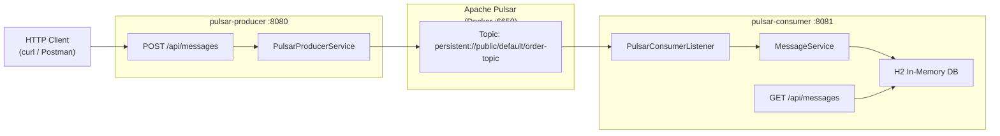

# Apache Pulsar POC - Implementation Plan

A proof-of-concept demonstrating asynchronous messaging between two Spring Boot microservices via **Apache Pulsar**. The producer accepts HTTP requests and publishes messages to a Pulsar topic. The consumer listens to that topic and persists each message to an **H2 in-memory database**, also exposing a REST endpoint to query stored messages.

## Architecture



## Project Layout

```
/Users/amresh/ag/
├── docker-compose.yml          # Pulsar standalone
├── pulsar-producer/            # Spring Boot producer
│   ├── pom.xml
│   └── src/main/java/...
└── pulsar-consumer/            # Spring Boot consumer
    ├── pom.xml
    └── src/main/java/...
```

---

## Proposed Changes

### Infrastructure

#### [NEW] docker-compose.yml
- Runs **Apache Pulsar standalone** (image: `apachepulsar/pulsar:3.2.0`)
- Exposes ports `6650` (broker) and `8080` (admin UI)

---

### Producer Microservice (`pulsar-producer`, port 8080)

#### [NEW] pom.xml
- Spring Boot 3.x, `spring-boot-starter-web`
- `pulsar-client` (Apache Pulsar Java client 3.x)

#### [NEW] application.yml
```yaml
server:
  port: 8080
pulsar:
  broker-url: pulsar://localhost:6650
  topic: persistent://public/default/order-topic
```

#### [NEW] MessageRequest.java  
DTO with `id`, `content`, `timestamp` fields.

#### [NEW] PulsarProducerConfig.java  
Spring `@Configuration` that creates a `PulsarClient` bean.

#### [NEW] MessageProducerService.java  
`@Service` that creates a Pulsar `Producer<String>` and sends JSON-serialized messages.

#### [NEW] MessageController.java  
`POST /api/messages` — accepts `MessageRequest` body and delegates to producer service.

---

### Consumer Microservice (`pulsar-consumer`, port 8081)

#### [NEW] pom.xml
- Spring Boot 3.x, `spring-boot-starter-web`, `spring-boot-starter-data-jpa`
- `pulsar-client`, `com.h2database:h2`

#### [NEW] application.yml
```yaml
server:
  port: 8081
pulsar:
  broker-url: pulsar://localhost:6650
  topic: persistent://public/default/order-topic
  subscription: order-subscription
spring:
  datasource:
    url: jdbc:h2:mem:orderdb
  h2.console.enabled: true
```

#### [NEW] Message.java  
JPA `@Entity` with `id`, `content`, `receivedAt` fields.

#### [NEW] MessageRepository.java  
`extends JpaRepository<Message, Long>`

#### [NEW] PulsarConsumerListener.java  
`@Component` that starts a Pulsar consumer in `@PostConstruct` on its own thread and persists every message via `MessageRepository`.

#### [NEW] MessageQueryController.java  
`GET /api/messages` — returns all persisted messages from H2.

---

## Verification Plan

### Automated: None (Spring Boot integration tests are out of scope for POC)

### Manual Verification

**Pre-requisite**: Docker Desktop must be running.

1. **Start Pulsar**  
   ```bash
   cd /Users/amresh/ag
   docker-compose up -d
   ```
   Wait ~15s, then confirm: `docker-compose logs pulsar | grep "messaging service is ready"`

2. **Start Producer** (new terminal)  
   ```bash
   cd /Users/amresh/ag/pulsar-producer
   ./mvnw spring-boot:run
   ```
   Expect: `Started PulsarProducerApplication on port 8080`

3. **Start Consumer** (new terminal)  
   ```bash
   cd /Users/amresh/ag/pulsar-consumer
   ./mvnw spring-boot:run
   ```
   Expect: `Started PulsarConsumerApplication on port 8081`

4. **Publish a message**  
   ```bash
   curl -X POST http://localhost:8080/api/messages \
     -H "Content-Type: application/json" \
     -d '{"content": "Hello Pulsar!"}'
   ```
   Expected response: `202 Accepted` with message details.

5. **Verify persistence**  
   ```bash
   curl http://localhost:8081/api/messages
   ```
   Expected: JSON array containing the published message.

6. **H2 Console** (optional)  
   Open `http://localhost:8081/h2-console` — JDBC URL: `jdbc:h2:mem:orderdb`
